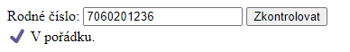
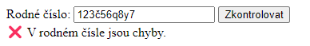
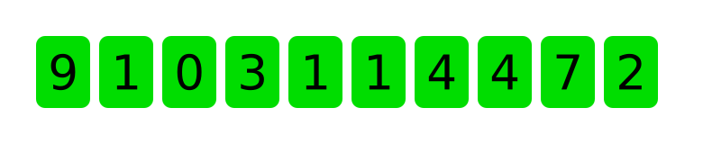
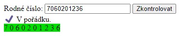
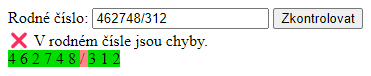

## Rodná čísla

Napište program, který zjistí, jestli je zadané rodné číslo platné.
(Skutečná rodná čísla mají 9 nebo 10 číslic, my budeme uvažovat pouze rodná čísla mladších lidí, která mají 10 číslic.)
Postupujte dle následujících kroků.

1. Založte si projekt příkazem
   ```shell
   npm init kodim-app@latest cviceni-rodna-cisla html-css-js
   ```
   Ve VS Code otevřete složku `cviceni-rodna-cisla`.
1. Pomocí funkce `prompt` se zeptejte uživatele na rodné číslo. Rodné číslo zkontrolujte podle bodů popsaných níže.
1. Každé rodné číslo musí mít přesně 10 znaků. Zkontrolujte tedy, že zadaný řetězec je délky 10 a neprojdou nám například vstupy typu

   > nepovím

   Slovo „nepovím“ má totiž jen 7 znaků.

   > 123456789123456789

   Řetězec „123456789123456789“ má totiž 18 znaků.

   Pokud uživatel zadal číslo špatné délky, **vypište do stránky text**:

   > ❌ Uživatel zadal rodné číslo neplatné délky.

   V opačném případě vypište:

   > ✔️ Zadané rodné číslo má správně deset znaků.

1. Každé rodné číslo musí být celé číslo. Zda je nějaká hodnota celé číslo, v JavaScriptu zkontrolujete pomocí funkce `Number.isInteger`. Musíte však vstup předtím převést na číslo pomocí funkce `Number`.

   ```js
   Number.isInteger(Number('25')); // vrací true
   Number.isInteger(Number('25.16')); // vrací false
   Number.isInteger(Number('ahoj')); // vrací false
   ```

   Opět **vypište do stránky**, zda podmínka platí.

   > ✔️ Rodné číslo je celé číslo.
   >
   > ❌ Rodné číslo obsahuje nepovolené znaky.

1. Každé rodné číslo musí být dělitelné 11. Zkontrolujte tedy, že zadané číslo je dělitelné jedenácti, a výsledek opět **vypište do stránky**.

> ✔️ Rodné číslo je dělitelné 11.
>
> ❌ Rodné číslo není dělitelné číslem 11.

1. Pokud jsou všechny podmínky splněny, rodné číslo budeme považovat za platné. Informaci o platnosti **vypište do stránky**.

> ✔️ Zadané rodné číslo je platné.
>
> ❌ Uživatel zadal neplatné rodné číslo.

Po zadání rodného čísla by se na stránce měly objevit čtyři výpisy.


<details>
<summary><b>Řešení</b></summary>

```js
const rodneCislo = prompt('Jaké je tvé rodné číslo?');
let platne = true;

if (rodneCislo.length === 10) {
  document.body.innerHTML += '✔️ Zadané rodné číslo má správně deset znaků.<br>';
} else {
  document.body.innerHTML += '❌ Uživatel zadal rodné číslo neplatné délky.<br>';
  platne = false;
}

if (Number.isInteger(Number(rodneCislo))) {
  document.body.innerHTML += '✔️ Rodné číslo je celé číslo.<br>';
} else {
  document.body.innerHTML += '❌ Rodné číslo obsahuje nepovolené znaky.<br>';
  platne = false;
}

if (Number(rodneCislo) % 11 === 0) {
  document.body.innerHTML += '✔️ Rodné číslo je dělitelné 11.<br>';
} else {
  document.body.innerHTML += '❌ Rodné číslo není dělitelné číslem 11.<br>';
  platne = false;
}

if (platne) {
  document.body.innerHTML += '✔️ Zadané rodné číslo je platné.<br>';
} else {
  document.body.innerHTML += '❌ Uživatel zadal neplatné rodné číslo.<br>';
}
```

</details>

## Platnost jako funkce

Přepiště kód z předchozího příkladu do funkce s názvem `checkBirthID`, která zkontroluje platnost rodného čísla. Funkce bude mít jeden parametr, ve kterém bude očekávat rodné číslo jako řetězec. Funkce bude vracet řetězec s výsledkem kontroly podle následujících pravidel:

- `'invalidLength'` v případě, že vstup nemá 10 znaků,
- `'notANumber'` v případě, že vstup není číslo,
- `'failedChecksum'` v případě, že číslo není dělitalné 11,
- `'ok'` v případě, že číslo prošlo kontrolou.

Funkci otestujte třeba na hodnotách:

```js
const rodnaCislaKOtestovani = [
  '123',
  'nepovím',
  '7060201236',
  '7060201235',
  '123456789123456789',
  '9062185440',
  '123č56q8y7',
];
```

<details>
<summary><b>Řešení</b></summary>

```js
const checkBirthID = (rodneCislo) => {
  if (rodneCislo.length !== 10) {
    return 'invalidLength';
  }

  if (!Number.isInteger(Number(rodneCislo))) {
    return 'notANumber';
  }

  if (Number(rodneCislo) % 11 !== 0) {
    return 'failedChecksum';
  }

  return 'ok';
};

const rodnaCislaKOtestovani = [
  '123',
  'nepovím',
  '7060201236',
  '123456789123456789',
  '9062185440',
  '123č56q8y7',
];

rodnaCislaKOtestovani.forEach((rc) => {
  document.body.innerHTML += `Rodné číslo <code>${rc}</code> `;
  const vysledek = checkBirthID(rc);
  if (vysledek === 'ok') {
    document.body.innerHTML += 'je platné. ✔️<br>';
  } else {
    document.body.innerHTML += `není neplatné. Důvod: ${vysledek}. ❌<br>`;
  }
});
```

</details>

## Kontrola cifer

V případě, že uživatel zadal do rodného čísla špatné znaky, budeme chtít tyto znaky vypsat a ukázat, kde se stala chyba. Pokračuje v kódu z předchozího příkladu.

1. Vytvořte pole `digits` obsahující všechny cifry `'0'` až `'9'` jako řetězce.
1. Napište funkci `isDigit`, která na vstupu dostane řetězec a vrátí `true`, pokud tento řetězec obsahuje právě jednu cifru. Použijte k tomu pole `digits` a metodu `includes` ([viz dokumentace](https://developer.mozilla.org/en-US/docs/Web/JavaScript/Reference/Global_Objects/Array/includes)). V opačném případě funkce vrátí `false`.
1. Napište funci `logInvalidCharacters`. Funkce na vstupu dostane řetězec, ten převede na pole znaků (zkuste vygooglit, jak na to). Následně všechny znaky projde pomocí `forEach`. Do konzole vypíše ty znaky, které nesplňují podmínky z funkce `isDigit`. `logInvalidCharacters` vyzkoušejte například na textu `'123č56q8y7'` a `'7060201236'`. V prvním případě by se v konzoli mělo objevit na třech řádcích `č`, `q` a `y`. Pro druhý text by se nemělo vypsat nic.

<details>
<summary><b>Řešení</b></summary>

### `index.js`

```js
const digits = ['0', '1', '2', '3', '4', '5', '6', '7', '8', '9'];

const isDigit = (znak) => znak.length === 1 && digits.includes(znak);

const logInvalidCharacters = (vstup) => {
  Array.from(vstup).forEach((znak) => {
    if (!isDigit(znak)) {
      document.body.innerHTML += `Vstup obsahuje neplatný znak „${znak}“.<br>`;
    }
  });
};

const checkBirthID = (rodneCislo) => {
  if (rodneCislo.length !== 10) {
    return 'invalidLength';
  }

  if (!Number.isInteger(Number(rodneCislo))) {
    return 'notANumber';
  }

  if (Number(rodneCislo) % 11 !== 0) {
    return 'failedChecksum';
  }

  return 'ok';
};

const rodnaCislaKOtestovani = [
  '123',
  'nepovím',
  '7060201236',
  '123456789123456789',
  '9062185440',
  '123č56q8y7',
];

rodnaCislaKOtestovani.forEach((rc) => {
  document.body.innerHTML + `Rodné číslo <code>${rc}</code> `;
  const vysledek = checkBirthID(rc);
  if (vysledek === 'ok') {
    document.body.innerHTML += 'je platné. ✔️<br>';
  } else {
    document.body.innerHTML += `je neplatné. Důvod: ${vysledek}. ❌<br>`;

    if (vysledek === 'notANumber') {
      logInvalidCharacters(rc);
    }
  }
});
```

</details>

## Detailní kontrola cifer

V předchozím cvičení jsme pomocí cyklu vypisovali všechny špatně zadané znaky do konzole. Nyní tento kód přepíšeme tak, aby místo výpisů do konzole vyrobil pole objektů, obsahující informace o každém znaku. Například pro vstup `462748/312` chceme jako výsledek obdržet takovéto pole.

```js
[
  { char: '4', digit: true },
  { char: '6', digit: true },
  { char: '2', digit: true },
  { char: '7', digit: true },
  { char: '4', digit: true },
  { char: '8', digit: true },
  { char: '/', digit: false },
  { char: '3', digit: true },
  { char: '1', digit: true },
  { char: '2', digit: true },
];
```

Napište tedy funkci `validateCharacters`, která na vstupu dostane text a vrátí pole ve formátu jako výše. Postupujte následovně:

1. Na začátku funkce si vytvořte proměnnou `result`, do které uložte prázdné pole.
1. Projděte vstup znak po znaku jako v předchozim cvičení. Místo výpisu do stránky však pro každý znak vyrobte odpovídající objekt a vložte jej do pole `result` pomocí metody `push`.
1. Na konci funkce pole `result` vraťte pomocí `return`.
1. Vyzkoušejte vaši funci zavolat třeba se vstupy `'123č56q8y7'` a `'7060201236'` a výsledná pole vypište pro otestování do konzole (pomocí `console.log`).

   ```js
   > validateCharacters('123č56q8y7')
   [
     { char: '1', digit: true },
     { char: '2', digit: true },
     { char: '3', digit: true },
     { char: 'č', digit: false },
     { char: '5', digit: true },
     { char: '6', digit: true },
     { char: 'q', digit: false },
     { char: '8', digit: true },
     { char: 'y', digit: false },
     { char: '7', digit: true },
   ];
   > validateCharacters('7060201236')
   [
     { char: '7', digit: true },
     { char: '0', digit: true },
     { char: '6', digit: true },
     { char: '0', digit: true },
     { char: '2', digit: true },
     { char: '0', digit: true },
     { char: '1', digit: true },
     { char: '2', digit: true },
     { char: '3', digit: true },
     { char: '6', digit: true },
   ];
   ```

<details>
<summary><b>Řešení</b></summary>

```js
const validateCharacters = (vstup) => {
  const result = [];
  Array.from(vstup).forEach((znak) => {
    result.push({ char: znak, digit: isDigit(znak) });
  });
  return result;
};
```


</details>


## Vstup pomocí formuláře

Upravte vaši aplikaci na kontrolu rodných čísel tak, aby obsahovala formulář.

1. Do HTML vaší stránky vložte formulář s textovým políčkem pro rodné číslo. Formulář se bude odesílat tlačítkem _Zkontrolovat_.
1. Na událost `submit` formuláře pověste posluchač, který provede kontrolu zadaného rodného čísla tak, jak jsme ji dělali v předchozích cvičeních.
1. Do HTML vložte pod formulář `div` s nějakým vhodně zvoleným `id`. Tento `div` bude představovat zprávu pro uživatele.
1. Z přechozích cvičení máme hotovou funkci `checkBirthID`, Pokud pro uživatelův vstup vrátí `'ok'`, vypište do vašeho `div`u

> ✔️ V pořádku.

1. Pokud vrátí cokoliv jiného, vypište zprávu ve smyslu

> ❌ V rodném čísle jsou chyby.

1. Vyzkoušejte do formuláře vyplnit aspoň jedno platné rodné číslo a jedno neplatné.






<details>
<summary><b>Řešení</b></summary>

### `index.html`

```html
<!DOCTYPE html>
<html lang="cs">
  <head>
    <meta charset="UTF-8" />
    <meta name="viewport" content="width=device-width, initial-scale=1.0" />
    <title>Opakování JavaScriptu</title>
    <script type="module" src="index.js"></script>
  </head>
  <body>
    <form id="formular">
      <label>Rodné číslo: <input /></label>
      <button>Zkontrolovat</button>
    </form>
    <div id="vystup"></div>
  </body>
</html>
```

### `index.js`

```js
// … zde jsou validační funkce z předchozích cvičení …

const formular = document.querySelector('#formular');
formular.addEventListener('submit', (event) => {
  event.preventDefault();
  const vstup = formular.querySelector('input').value;
  const vystupElm = document.querySelector('#vystup');
  if (checkBirthID(vstup) === 'ok') {
    vystupElm.textContent = '✔️ V pořádku.';
  } else {
    vystupElm.textContent = '❌ V rodném čísle jsou chyby.';
  }
});
```

</details>


## Cifry jako HTML elementy

Pokračuje v kódu předchozího příkladu. Budeme chtít zobrazit jednotlivé cifry rodného čísla dle následujícího vzoru.



Cifry budeme do stránky vkládat pomocí vlastnosti `innerHTML`.

1. Nedříve si rozmysleme, jak bude vypadat HTML pro jednu cifru. Může jít například o jednoduchý `div` s nějakou vhodně nastylovanou třídou.
1. Pokud je znak platná číslice, bude mít na stránce zelené pozadí `#00DD00`. V opačném případě bude mít červené pozadí `#FF8686`.
1. V souboru `index.html` vytvořte `div` s nějakým smysluplným `id`, ve kterém budeme zobrazovat jednotlivé cifry. Nastylujte jej pomocí flexboxu tak, abychom mohli cifry zobrazovat vedle sebe.
1. Jakmile uživatel klikne na tlačítko _Zkontrolovat_, zavolejte pro uživatelův vstup funkci `validateCharacters`. Projděte vrácené pole pomocí cyklu `forEach` a naplňte váš připravený `div` ciframi s použitím vlastnosti `innerHTML`.

Vaše aplikce by měla ve výsledku fungovat tak, že kdykoliv uživatel zadá rodné číslo a nechá si jej zkontrolovat, aplikace vypíše, zda je číslo zadané dobře nebo špatně, a zobrazí jednotlivé znaky čísla s tím, že cifry jsou zelené a špatně zadané znaky jsou červené.





<details>
<summary><b>Řešení</b></summary>

### `index.html`

```html
<!DOCTYPE html>
<html lang="cs">
  <head>
    <meta charset="UTF-8" />
    <meta name="viewport" content="width=device-width, initial-scale=1.0" />
    <title>Opakování JavaScriptu</title>
    <script type="module" src="index.js"></script>
  </head>
  <body>
    <form id="formular">
      <label>Rodné číslo: <input /></label>
      <button>Zkontrolovat</button>
    </form>
    <div id="vystup"></div>
    <div id="cifry"></div>
  </body>
</html>
```

### `index.js`

```js
const formular = document.querySelector('#formular');
formular.addEventListener('submit', (event) => {
  event.preventDefault();
  const vstup = formular.querySelector('input').value;
  const vystupElm = document.querySelector('#vystup');
  const vysledekValidace = checkBirthID(vstup);
  if (vysledekValidace === 'ok') {
    vystupElm.textContent = '✔️ V pořádku.';
  } else {
    vystupElm.textContent = '❌ V rodném čísle jsou chyby.';
  }

  const overeni = validateCharacters(vstup);
  const cifry = document.querySelector('#cifry');

  overeni.forEach((znak) => {
    cifry.innerHTML += `
      <span style="background-color: ${znak.digit ? '#00DD00' : '#FF8686'}">
        ${znak.char}
      </span>
    `;
  });
});
```


</details>