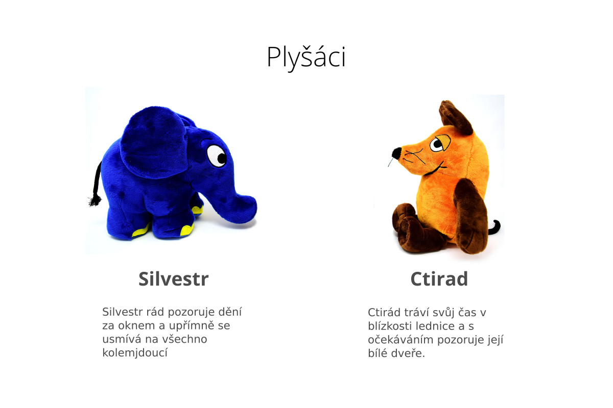

# Cvičení: Komponenty
## První kroky s JSX

Vyzkoušejte si založení jednoduché aplikace používající JSX s jednou stránkou a jednoduchým CSS.

1. Pomocí nástroje `kodim-app` vytvořte nový JSX Vite projekt.
   ```shell
   npm init kodim-app@latest prvni-kroky jsx
   ```
1. Projekt spusťte pomocí `npm run dev`.
1. Prohlédněte si soubor `src/pages/index.jsx`. Přímo ve volání funkce `render` změňte nadpis stránky `h1` v hlavičce a uveďte zde svoje jméno.
1. Stále v souboru `index.jsx` vytvořte komponentu pro hlavičku stránky. Uvnitř této komponenty uložte své vlastní jméno do proměnné a obsah této proměnné vložte do JSX. Vložte vaši komponentu na místo, kde je nyní použitý element `header`.
1. V souboru `index.css` vytvořte CSS třídu `intro` a nastavte v ní `font-style` na `italic`. Uložte si název této třídy do proměnné a tu pak použijte jako `className` pro odstavec `p` na vaší stránce.

## Plyšáci

Vytvořte pomocí JSX webovou stránku dle následujícího vzoru.



Postupujte dle následujících kroků.

1. Založte si nový JSX projekt:
   ```shell
   npm init kodim-app@latest plysaci jsx
   ```
1. Projekt spusťte pomocí `npm run dev`, jak už to znáte z dřívejška.
1. V hlavním souboru `index.jsx` smažte JSX ve funkci `render` a vložte do ní JSX s následujícím obsahem.
   ```jsx
   <h1>Plyšáci</h1>
   <div className="plushies"></div>
   ```
   Nezapomeňte obsah správně obalit do fragmentu.
1. Vytvořte si proměnné obsahující informace o plyšácích dle následujícího vzoru.

   ```js
   const name1 = 'Silvestr';
   const image1 = 'adresa obrazku';
   const text1 =
     'Silvestr rád pozoruje dění za oknem a upřímně se usmívá na všechno kolemjdoucí.';

   const name2 = 'Ctirad';
   const image2 = 'adresa obrazku';
   const text2 =
     'Ctirad tráví svůj čas v blízkosti lednice a s očekáváním pozoruje její bílé dveře.';
   ```

1. Adresy obrázků si můžeme zkopírovat z těchto odkazů: [elephant](assets/elephant.jpg), [mouse](assets/mouse.jpg).
1. Karta s plyšákem by měla ve výsledné stránce vypadat takto.
   ```html
   <div class="plushy">
     
     <h2 class="plushy__name">Jméno plyšáka</h2>
     <p class="plushy__text">Text o plyšákovi</p>
   </div>
   ```
   Převeďte tento kód na JSX a vytvořte dvě komponenty `Silvestr` a `Ctirad`, kde každá bude vracet JSX pro jednoho plyšáka. Nezapomeňte, že v JSX se místo `class` píše `className`. Data pro obě karty vezměte přímo z proměnných výše.
1. Vložte obě komponenty do stránky a vyzkoušejte si, že se zobrazují.
1. Nastylujte stránku dle zadání.

# Cvičení: Oddělování komponent
## Jednoduchá aplikace

1. Založte si nový projekt:
   ```shell
   npm init kodim-app@latest aplikace-react jsx
   ```
1. Projekt spusťte pomocí `npm run dev`, jak už to znáte z dřívejška.
1. V hlavním souboru `index.jsx` vytvořte komponentu `HomePage`, která bude obsahovat základní strukturu stránky. Zatím to může být jen prázdný element `div` s třídou `container`. Komponentu zobrazte na stránce pomocí funkce `render`.
1. Založte ve složce `src` složku `components`. Vytvořte v této složce komponentu `Header`, která bude obsahovat kód pro hlavičku stránky. Jediná její `prop` bude `title` udávající obsah elementu `h1`. Správně komponentu exportujte.
1. Vytvořte pro komponentu `Header` soubor `style.css` s nějakým jednoduchým CSS pro hlavičku stránky. Soubor se styly v komponentě správně importuje.
1. V hlavním souboru `index.jsx` komponentu `Header` importujte a použijte ji uvnitř komponenty `HomePage`.
1. Následujte stejný postup jako výše a vytvořte komponentu `Footer`, která bude představovat patičku stránky. Tato komponenta bude mít také jednu `prop` s názvem `author`, která udává jméno autora stránky.
1. Do třetice vytvořte komponentu `Main`, která bude představovat hlavní obsah stránky. Tato komponenta bude mít opět jednu `prop` s názvem `content`, která bude udávat obsah odstavce.

## Kalendářová data
1. Založte si nový projekt:
   ```shell
   npm init kodim-app@latest datumy jsx
   ```
1. Projekt spusťte pomocí `npm run dev`, jak už to znáte z dřívějška.
1. Vytvořte komponentu `Today`, která bude očekávat tři props:

   - `day` - řetězec s číslem dne, například `'07'`,
   - `month` - řetězec s číslem měsíce, například `'12'`,
   - `year` - řetězec s číslem roku, například `'2020'`.

   Tato komponenta by měla zobrazit datum ve formátu 07.12.2020. Zabalte každou položku datumu do zvláštního `span` elementu a dejte každé vlastní CSS třídu, abychom mohli den, měsíc i rok nastylovat zvlášť.

1. Vytvořte komponentu `HomePage` tak, aby na stránce zobrazila tři různé datumy pomocí `Today`.
1. Pro komponentu `Today` vytvořte soubor se styly a nastylujte číslo pro den tak, aby bylo zobrazeno tučně, a číslo pro rok tak, aby bylo zobrazeno o 20 % menším fontem.