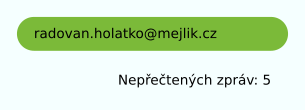
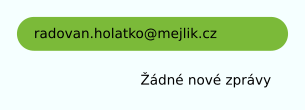

# Podmíněné výrazy, destrukturování
## Destrukturování

Založte si JavaScriptový soubor s názvem `index.js` a vložte do něj následující objekt:

```js
const recipe = {
  name: 'Spicy Thai Basil Chicken',
  cuisine: 'Thai',
  difficulty: 'Intermediate',
  serves: 4,
  ingredients: {
    chicken: {
      type: 'Boneless, skinless chicken thighs',
      amount: '1 lb',
    },
    vegetables: [
      'Bell peppers',
      'Onion',
      'Thai bird chili',
      'Garlic',
      'Thai basil leaves',
    ],
    seasonings: ['Fish sauce', 'Soy sauce', 'Oyster sauce', 'Brown sugar'],
    others: ['Vegetable oil', 'Water'],
  },
  instructions: [
    'Slice the chicken into bite-sized pieces.',
    'Heat vegetable oil in a large skillet or wok over medium-high heat.',
    'Add minced garlic and Thai bird chili to the skillet. Stir-fry for 30 seconds.',
    'Add the sliced chicken to the skillet. Cook until browned and cooked through.',
    'Add sliced bell peppers and onion to the skillet. Cook until vegetables are tender-crisp.',
    'In a small bowl, mix together fish sauce, soy sauce, oyster sauce, brown sugar, and water.',
    'Pour the sauce over the chicken and vegetables in the skillet. Stir well to combine.',
    'Add Thai basil leaves to the skillet. Stir until the basil wilts.',
    'Remove from heat and serve hot with steamed rice.',
  ],
  notes:
    'Adjust the amount of Thai bird chili according to your spice preference. Serve with a wedge of lime for extra flavor.',
};
```

1. Pomocí destrukturování si vytvořte proměnnou `name`, do které uložte hodnota klíče `name` z objektu `recipe`.
2. Podobným způsobem si vytvořte proměnné `cuisine`, `ingredients` a `instructions`.
3. Z objektu `ingredients` si pomocí destrukturování vytvořte proměnné `chicken`, `vegetables`, `seasonings` a `others`.

## Podmíněné jednohubky
Přepište následující úryvky kódu tak, aby místo podmínek používaly operátor pro podmíněný výraz. Pracujeme v čistém JavaScriptu, není tedy potřeba zakládat ani React ani Webpack projekt.

1.  ```js
    const password = prompt('Zadejte heslo:');
    let valid = null;
    if (password.length > 8) {
      valid = 'Heslo je v pořádku';
    } else {
      valid = 'Heslo není bezpečné';
    }
    ```
1.  ```js
    const grade = prompt('Počet bodů z písemky:');
    let passed = null;
    if (grade >= 50) {
      passed = '<span>prošel</span>';
    } else {
      passed = '<span class="red">neprošel</span>';
    }
    ```
   
## JSX žárovka

Vzpomeňte si na naše cvičení z vanilla JavaScriptu, kdy jsme rozsvěcovali a zhasínali žárovku. Zkusíme naši žárovku zprovoznit pomocí JSX. Styly a obrázky pro žárovku můžete v průběhu cvičení vykrádat z původního zadání v repozitáři [cviceni-zarovka](https://github.com/Czechitas-podklady-WEB/cviceni-zarovka).

1. Založte si nový JSX projekt pomocí
   ```shell
   npm init kodim-app@latest jsx-zarovka jsx
   ```
1. Ve vašem projektu vytvořte v samostatné složce komponentu `Bulb`. Zařiďte, aby vytvořila jeden `div` s třídou `bulb`.
1. Styly a obrázky týkající se žárovky vložte do složky `Bulb`. Styly týkající se stránky samotné vložte do hlavního souboru `global.css`.
1. Použijte komponentu `Bulb` a zobrazte žárovku na stránce.
1. Chceme zařídit, že pokud komponentu použijeme takto

   ```js
   <Bulb on={false} />
   ```

   zobrazí se zhasnutá žárovka. Pokud ji naopak použijeme takto

   ```js
   <Bulb on={true} />
   ```

   žárovka se zobrazí rozsvícená. Kýženého chování dosáhnete tak, že sestavíte obsah atributu `className` pomocí podmíněného operátoru v závislosti na hodnotě v prop `on`. Nezapomeňte, že třída `bulb` musí být na elementu žárovky přítomna vždy, rozsvícená žárovka bude mít navíc k třídě `bulb` ještě třídu `bulb--on` (názvy tříd vycházejí z metodiky BEM).

1. Vložte na vaši stránku dvě zhasnuté a dvě rozsvícené žárovky.


# Podmíněné zobrazení
## Mejlík – schránka

V tomto cvičení vytvoříme základ komponenty pro zobrazování příchozí e-mailové pošty v naší nové aplikaci jménem :i[Mejlík.cz].

1. Založte si nový JSX projekt:
   ```shell
   npm init kodim-app@latest mejlik jsx
   ```
1. Vytvořte komponentu `Inbox`, která se použije takto.

   ```js
   <Inbox account="radovan.holatko@mejlik.cz" messages={5} />
   ```

   Komponenta bude zobrazovat e-mail uživatele a počet jeho nepřečtených zpráv. Komponentu nastylujte dle následujícího vzoru

   

1. Použijte v komponentě podmíněný operátor tak, aby zobrazila jinou zprávu v případě, že počet nepřečtených zpráv je nula.

   

1. Upravte vaši komponentu tak, že zpráva udávající počet zpráv bude složitější JSX než pouze text. Pokud máme nepřečtené zprávy, zobrazte

   ```js
   <div className="unread">Nepřečtených zpráv: 5</div>
   ```

   Pokud žádné nepřečtené zprávy nemáme, zobrazte

   ```js
   <div className="no-unread">Žádné nepřečtené zprávy</div>
   ```

1. Upravte CSS styly tak, aby zpráva s třídou `no-unread` měla jiné stylování, například světlejší text.


## Mejlík – schránka


1. Pokračujte v projektu z předchozího cvičení.
1. Vzor stránky je na GitHubu v repozitáři [cviceni-mejlik-hlavicka-vzor](https://github.com/Czechitas-podklady-WEB/cviceni-mejlik-hlavicka-vzor). Tento repozitář slouží jen jako vzor, proto z něj **nebudeme vytvářet vlastní repozitář** (nebudeme ho používat jako šablonu).
1. Místo toho naklonujeme na lokální disk rovnou původní repozitář – tj. rovnou ho naklonujte pomocí příkazu `git clone https://github.com/Czechitas-podklady-WEB/cviceni-mejlik-hlavicka-vzor.git`.
1. Ve staženém repozitáři `cviceni-mejlik-hlavicka-vzor` najdete nastylované dvě verze hlavičky pro naši aplikaci. Pozor, že soubory `index.html` a `style.css` slouží pouze jako vzor. Nekopírujte je do svého projektu.
1. Uvnitř vašeho vlastního projektu založte komponentu `Header`, která bude žít ve vlastní složce. Bude představovat hlavičku stránky. Jak napsat její JSX můžete okouknout ze vzorového `index.html` (nezapomeňte atributy `class` změnit na `className`. Pro hromadnou náhradu se bude ve VS Code hodit zkratka <kbd>Ctrl+Shift+L</kbd> (na Windows a Linuxu) nebo <kbd>Command+Shift+L</kbd> (na MacOS), která označí všechny výskyty daného slova).
1. Podívejte se do vzoru, jak je hlavička nastylovaná. Styly pro hlavičku ze vzorového `style.css` vložte do stylů vaší komponenty.
1. Komponenta hlavičky používá dva obrázky. Vytvořte pro ně složku `img` uvnitř složky `Header`. Vložte do ní obrázky ze vzoru.
1. Chceme zařídit, že pokud je komponenta použita takto

   ```js
   <Header user="Radovan Holátko" />
   ```

   zobrazí se hlavičku s přihlášeným uživatelem. Pokud je naopak použita takto

   ```js
   <Header />
   ```

   zobrazí se hlavička nabízející přihlášení. Pokud jsme do `props` při použití komponenty nevložili žádnou hodnotu, znamená to, že obsahuje hodnotu `undefined`.