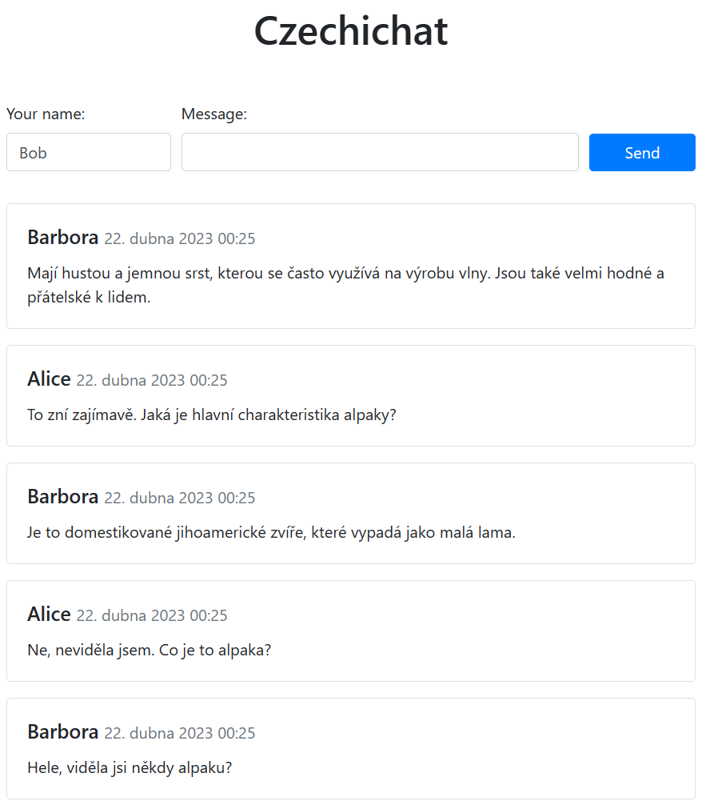

# Cvičení: Požadavek POST
## Chat

V tomto cvičení si vytvoříte vlastní chatovací aplikaci.



1.  Vytvořte Vite/JSX projekt pomocí:

    ```bash
    npm init kodim-app@latest chat jsx
    ```

1.  Do stránky přidejte formulář s jedním textovým políčkem pro uživatelovu zprávu a tlačítkem pro odeslání.

1.  Na konci souboru `index.jsx` přidejte posluchač události `submit` na formulář. V jeho obsluze zamezte výchozímu odeslání formuláře (`preventDefault`).

    1.  Obsah textového políčka zašlete na chatovací server.

        #### Parametry pro zaslání zprávy

        - Endpoint: `https://czechichat.deno.dev/api/send-message`
        - Metoda: `POST`
        - Hlavička: `Content-Type: application/json`
        - Tělo: JSON objekt s vlastností `message` obsahující text zprávy

        V JavaScriptu by odeslání zprávy mohlo vypadat následovně:

        ```js
        fetch('https://czechichat.deno.dev/api/send-message', {
          method: 'POST',
          headers: {
            'Content-Type': 'application/json',
          },
          body: JSON.stringify({
            message: 'Ahoj. Toto je moje první zpráva.',
          }),
        });
        ```

    1.  Ověřte si, že vaše zpráva se propsala i do chatovacího serveru na adrese [czechichat.deno.dev](https://czechichat.deno.dev/).

1.  Po odeslání formuláře uživateli vymažte obsah políčka, aby měl prostor pro zprávu novou.

1.  K formuláři přidejte ještě jedno textové políčko na jméno. Nezapomeňte obě políčka označit štítkem `<label>`.

1.  Při odesílání formuláře přidejte do požadavku na server do těla zprávy ještě jméno jako vlastnost `name`.

    Tělo by mohlo vypadat takto:

    ```js
    {
    	name: 'Karel',
    	message: 'Toto je moje první zpráva.',
    }
    ```

    Obsah políčka se jménem uživateli nemažte. Pravděpodobně ho bude chtít použít i pro další zprávu.

1.  Opět si ověřte, že se zpráva propisuje do serveru a tentokrát i se jménem.

#### Bonusy

1.  Přidejte výpis zpráv ze serveru například jako odrážkový seznam ve tvaru `Jméno: text zprávy (datum)`.

    #### Parametry pro získání historie zpráv

    - Endpoint: `https://czechichat.deno.dev/api/list-messages`
    - Metoda: výchozí `GET`
    - Hlavičky: výchozí
    - Tělo: žádné

    Stahujte zprávy v pravidelných intervalech každé tři sekundy, aby uživatel viděl, když dorazí nová.

1.  Stránku nastylujte.

## Hlasování

Vytvoříme aplikaci, která umožní hlasovat pro jednotlivé možnosti na webu _Hlasování_. Pro tento účel si vyberte z nabídky jednu otázku, ve které budete hlasovat.

1. Založte si nový Vite/JSX projekt příkazem

```shell
npm init kodim-app@latest cviceni-hlasovani jsx
```

1. Otevřete si ve VS Code vytvořenou složku `cviceni-hlasovani`.
1. Prohlédněte si dokumentaci [API pro hlasování](https://apps.kodim.cz/daweb/hlasovani/docs) a pomocí požadavku GET v prohlížeči najděte `id` otázky, kterou jste si ve skupině vybrali.
1. Na stránku přidejte tlačítko :i[Hlasovat]. Pověste na toto tlačíko posluchač a zatím na stisk pouze vypište něco do konzole pro ověření, že posluchač funugje.
1. Při stisknutí tlačítka pošlete na API požadavek POST, který zahlasuje vaším jménem pro nějakou vámi zvolenou možnost. Jméno i možnost zatím budou zapsány natvrdo ve vašem kódu. **Nezapomeňte** posluchač události označit jako `async`.
1. Na stránce [hlavní aplikace](https://apps.kodim.cz/daweb/hlasovani) si ověřte, že se vám povedlo správně zahlasovat.


# Cvičení: Odesílání dat z formuláře
## Hlasování, jméno

Pokračujte v aplikaci z předchozího příkladu. Mít jméno hlasujícího přímo v kódu je nepraktické. Umožníme tedy uživateli zadat si jméno dle libosti.

1. V programu z minulého cvičení nahraďte hlasovací tlačítko formulářem, který bude obsahovat jedno textové políčko pro zadání jména.
1. Při odeslání formuláře zahlasujte pro jednu možnost jménem, které zadal uživatel. Číslo možnosti, pro niž se hlasuje, bude stále natvrdo v kódu.

## Vymyzání položky ze seznamu

Naše aplikace _Nákupy_ ještě neumí mazat položky seznamu. Do aplikace přidáme tlačítko, které odešle požadavek na smazání položky na server pomocí DELETE a překreslí komponentu.

1. Vyjděte z kódu aplikace vytvořené na lekci. Použijte repozitář [cviceni-nakupy-post](https://github.com/Czechitas-podklady-WEB/cviceni-nakupy-post) jako šablonu pro vytvoření vlastního repozitáře, který si naklonujte.
1. Nainstalujte závislosti příkazem `npm install` a pak spusťte vývojový server příkazem `npm run dev`.
1. V komponentě `ShopItem` je tlačítko, které bude sloužit ke smazání položky seznamu.
1. Vytvořte posluchač události `handleDelete` a připojte jej na tlačítko. Je to velmi podobné tomu, jak je vytvořen posluchač `handleSubmit` v hlavní stránce. Do vašeho posluchače zatím dejte například `console.log`, a vyzkoušejte, že funguje.
1. Udělejte posluchač rovnou `async`, ať jej máme připravený na volání `fetch`.
1. Nyní je potřeba odeslat požadavek na server. Zavolejte funkci `fetch`, která pošle požadavek metodou `DELETE` na adresu:
   ```
   https://nakupy.czechitas.dev/api/:day/:id
   ```
   Tělo požadavku (`body`) bude prázdné, vůbec jej neuvádějte. Nezapomeňte použít při autentizace své jméno. Po odeslání požadavku zavolejte funkci `window.location.reload()`, pro obnovení stránky.
1. Vyzkoušejte, že vaše aplikace funguje a že je možné pomocí tlačítka _Smazat_ smazat některou položku seznamu.

## Odškrtnutí nákupu

Pokračujte v aplikaci z předchozího příkladu. Rozšíříme náš nákupní seznam ještě o tlačítko _Nakoupeno_, které umožní označit položku jako zakoupenou.

Postup je velmi podobný jako v předchozím cvičení.

1. Do aplikace přidejte tlačítko _Nakoupeno_.
1. Založte `async` posluchač události `handleDone` a vyzkoušejte, že se zavolá při stisknutí tlačítka.
1. V obsluze události pošlete autentizovaný `PATCH` požadavek na stejnou adresu jako v předchozím příkladu
   ```
   https://nakupy.czechitas.dev/api/:day/:id
   ```
   Tentokrát je třeba odeslat toto JSON _body_:
   ```json
   {
     "done": true
   }
   ```
1. Opět vyzkoušejte, že aplikace funguje, a že můžete označit položku nákupu jako zakoupenou.