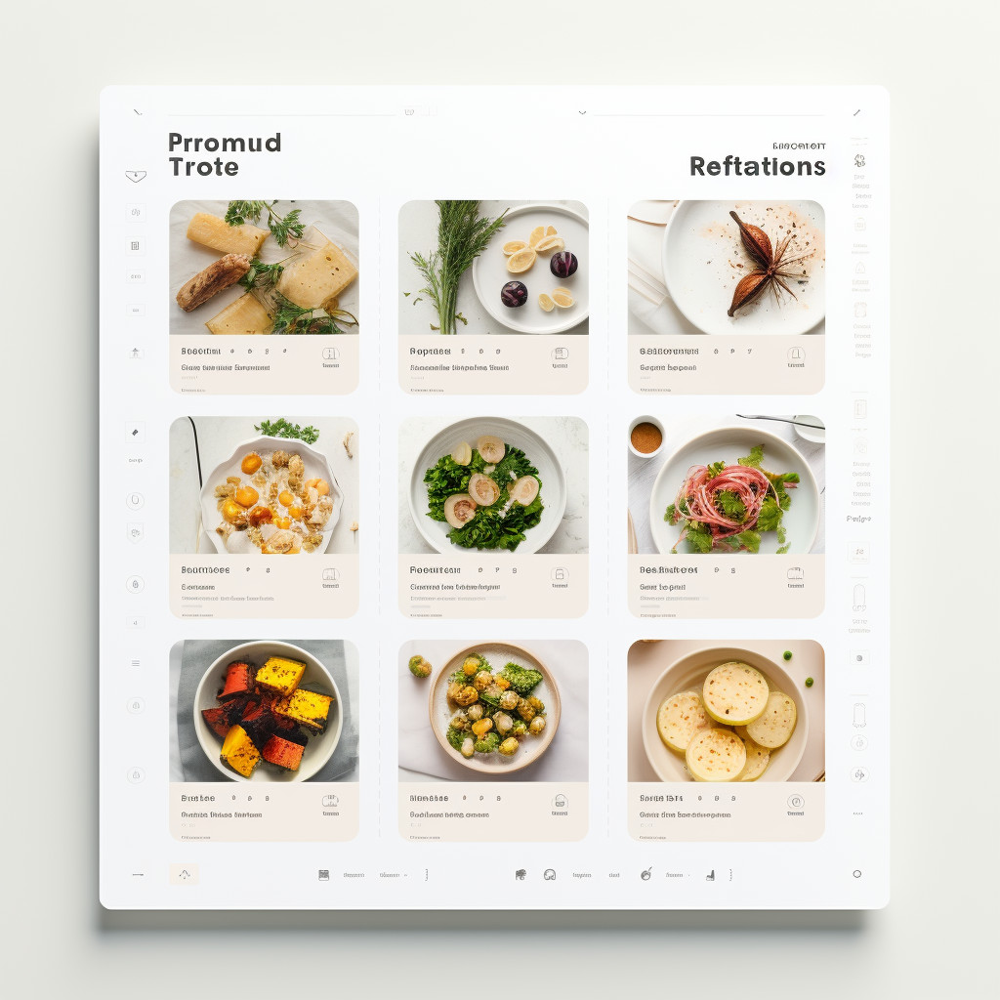

# Cvičení na úvod
## The Chirp

Začneme s již připraveným projektem, který obsahuje hlavní stránku sociální sítě _The Chirp_. Tato stránka zobrazuje seznam příspěvků všech uživatelů. Vaším úkolem bude rozšířit tento web stránku zobrazující profil uživatele.

### Rozběhnutí projektu

1. Pro spuštění projektu budeme potřeba lokální API. To najdete v repoziáři [ukazka-the-chirp-api](https://github.com/Czechitas-podklady-WEB/ukazka-the-chirp-api). Repozitář si naklonujte a API spusťte příkazem `npx apidroid@latest`.
1. Prohlédněte si kolekce v API. Tentokrát máme kolekce hned dvě: `users` a `posts`. Kolekce `users` obsahuje informace o uživatelích, kolekce `posts` obsahuje všechny příspěvky.
1. Naklonujte si repozitář s frontendem [ukazka-the-chirp](https://github.com/Czechitas-podklady-WEB/ukazka-the-chirp). Otevřete jej ve VS Code a spusťte příkaz `npm install`, kterým nainstalujete potřebné závislosti. Poté spusťte příkaz `npm run dev`, kterým spustíte vývojový server.
1. V prohlížeči si vyzkoušejte, jak aplikace funguje. Prohlédněte si její zdrojový kód a seznamte se s tím, jak je aplikace strukturovaná.

### Přidání stránky s profilem uživatele

1. Vytvořte novou stránku pro zobrazení profilu uživatele. Stránka bude dostupná na URL `/profil.html`. Bude tedy potřeba vytvořit nové soubory `profil.html`, `profil.jsx` a `profil.css`.
1. Zatím na stránku vložte pouze nadpis `h1` s textem `Profil uživatele`. Stránku si otevřete v prohlížeči a ověřte, že se nadpis zobrazuje.
1. V komponentě `Post` máte již připravený odkaz na prvku s třídou `post__handle`. Zatím nikam nevede. Sestavte URL odkazu tak, aby vedl na stránku s profilem uživatele a předal jí ID uživatele skrze search parametr `?user=`. Například pro uživatele s ID 42 by URL měla vypadat takto: `/profil.html?user=42`.
1. Na stránce s profilem uživatele získejte ID uživatele z URL. Načtěte z API informace o uživateli s tímto ID. Na stránce zobrazte jméno, handle a bio uživatele.
1. Zobrazte také avatar uživatele. Cesta k obrázku je uložena v atributu `avatar` uživatele. Musíte tuto cestu složit s URL vašeho API stejně, jako to dělá komponenta `Post`.
1. Nyní byste měli mít funkční zobrazení profilu každého uživatele kliknutím na jeho handle v seznamu příspěvků.

# Cvičení: CRUD operace
## Kuchtík

Podle následujícího zadání vytvořte aplikaci pro správu receptů. Aplikace bude mít dvě stránky, jedna bude v mřížce zobrazovat seznam receptů, druhá bude zobrazovat detail jednoho receptu, který si uživatel vybere na hlavní stránce. Aplikaci uživateli umožní přidávat nové recepty nebo mazat recepty již neaktuální.

**Toto cvičení dělejte ve dvojicích** v režimu takzvaného párového programování. To je způsob práce, kdy jeden programátor pracuje na svém počítači a druhý je pouze konzultant. Po nějakém čase si pak role prohoďte. Zadání cvičení je záměřně popsáno v obecných krocích, abyste měli prostor sami si rozymyslet a vzájmně prodiskutovat, jakým způsobem budete jednotlivé kroky řešit.

Co se týče vzhledu aplikace, můžete se inspirovat layoutem hlavní stránky, kterou pro nás laskavě vytvořila umělá inteligence [Midjourny](https://www.midjourney.com/):

1.  Nejprve si rozmyslete jaká data bude vaše aplikace potřebovat. Jak mohou vypadat informace o receptu se můžete inspirovat třeba na webu [Rohlik.cz](https://www.rohlik.cz/chef). Výhoda tohoto webu je, že mají i hezké obrázky, které si můžete pro účely tohoto cvičení vypůjčit. Rozmyslete si, jaké informace budete potřebovat pro seznam receptů a jaké pro detail jednoho receptu. S bohatostí informací to zároveň nepřehánějte, abyste nestrávili většinu času hledáním obrázků a psaním textů.
1.  Jakmile máte rozmyšlenou datovou strukturu, založte si API backend pomocí `apidroid`. Založte na backendu kolekci s recepty a naplňte ji několika recepty, které budeme později zobrazovat na hlavní stránce.
1.  Založte si Vite/JSX projekt pro frontend aplikace. Na hlavní stránce stáhněte z API seznam receptů a zobrazte je na stránce.
1.  Vytvořte komponentu `RecipeCard`, která bude zobrazovat jednu kartu s receptem. V této komponentě zobrazte název receptu, obrázek a popis. Vytvořte si pro tuto komponentu nějaké rozumné CSS styly.
1.  Do stránky přidejte formulář, do kterého uživatel může zadat nový recept. Formulář osaďte spoluchačem události `submit` a pomocí požadavku `POST` odešlete nový recept na server. Po úspěšném přidání receptu proveďte refresh stránky.
1.  Na kartu receptu přidejte možnost smazání. Protože je na stránce více receptů, potřebujete poznat, který recept chce uživatel smazat. Na tlačitko pro mazání proto přidejte `data-id` atribut s ID receptu.
1.  Na všechny tlačítka pro mazání navěsíte posluchače události. V posluchači události si přečtete ID receptu z vlastnosti `event.target.dataset.id`. Pomocí tohoto ID smažete recept na serveru. Nezapomeňte na refresh stránky.
1.  Na karty receptu přidejte odkaz pro přechod na detail receptu. Vytvořte stránku pro detail receptu a pomocí search parametrů jí předejte `id` receptu, který má zobrazit. Zobrazte recept na stránce.
1.  Na stránce s detaily receptu přidejte odkaz pro návrat na hlavní stránku, aby se uživatel mohl vrátit zpět na seznam receptů.

